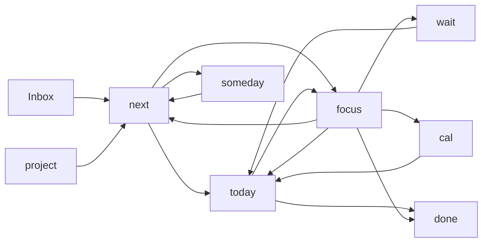

# GTD State Graph

The GTD workflow is a directed graph with flexible user-driven transitions.
The sections in `gtd.md` provide the visible placement; the event log provides
the history needed to understand how an item reached its current placement.

The diagram shows common transitions, not an exhaustive allow-list. Any known
destination, including Inbox, is valid from any known source. Returning an
item to Inbox means that it needs clarification again; it does not erase its
identity or history.

## Time interpretation

- Active work time is accumulated while the item is in a user-selected active
  state such as Today or Focus, according to recorded work events.
- Waiting time begins when the item enters `wait` and ends when it leaves
  `wait`.
- Scheduled time is recorded when the item enters `cal`; it is neither active
  work nor waiting time.
- A later `cal → today` transition records that the scheduled item became due
  and can begin active work.

The event stream, rather than the current section alone, is the source for
cycle-time and flow analysis.
